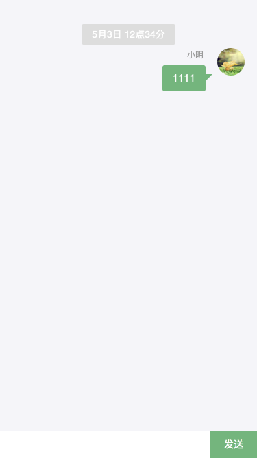

在线聊天组件

* 布局

| selector  | 说明     |
|-----------|--------|
| im-outlet | IM布局组件 |
| im-form   | 消息填写发送 |

im-outlet
| 名称         | 说明       |
|------------|----------|
| getMsgUrl  | 消息更新接口地址 |
| sendMsgUrl | 消息发送接口地址 |
| avatar     | 我的头像     |
| nickname   | 我的昵称     |
| list       | 消息队列     |


* 辅助布局

| selector    | 说明  |
|-------------|-----|
| [imContent] | 内容区 |
| [imHeader]  | 头部  |
| [imFooter]  | 底部  |

* 功能

| selector            | 说明     |
|---------------------|--------|
| [imContentOf]       | 聊天内容列表 |
| [imContentTemplate] | 聊天内容模板 |
| [imAvatar]          | 头像     |
| [imMessage]         | 消息     |
| [imMine]            | 我发送的消息 |
| [imNickname]        | 昵称     |
| [imSend]            | 发送按钮   |
| [imSystem]          | 系统消息   |
| [imText]            | 文本消息   |

```html
<im-outlet [imContentOf]="list">
  <im-form imFooter>
    <button imSend>发送</button>
  </im-form>
</im-outlet>
```

组件库


| 组件名         | 说明        | 地址                                  |
|-------------|-----------|-------------------------------------|
| iwe7-flex   | flex布局组件  | https://github.com/iwe7/iwe7-flex   |
| iwe7-map    | 百度地图组件    | https://github.com/iwe7/iwe7-map    |
| iwe7-im     | IM组件      | https://github.com/iwe7/iwe7-im     |
| iwe7-icss   | rxjs操作css | https://github.com/iwe7/iwe7-icss   |
| iwe7-core   | 核心库       | https://github.com/iwe7/iwe7-core   |
| iwe7-script | 加载css和js  | https://github.com/iwe7/iwe7-script |
